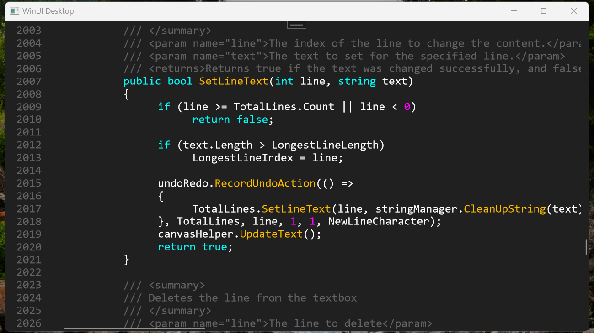

‼️Update in Progress (16.01.2025)‼️


<div align="center">

<h1>TextControlBox-WinUI</h1>
</div>

<div align="center">
     <!--<a href="https://www.microsoft.com/store/productId/9NWL9M9JPQ36">
         
    </a>-->


<!--[](https://www.nuget.org/packages/TextControlBox.JuliusKirsch)-->

</div>

<h3 align="center">A textbox for WinUI3 with syntax highlighting, line numbering, and support for a large amount of text</h3>

## Reason why I built it
WinUI has a default Textbox and a RichTextBox. Both of them are very slow in rendering multiple thousand lines. The selection works also very slow. So I decided to create my own version of a Textbox.

## Features:
- Viewing files with a million lines or more without performance issues
- Syntax highlighting
- Outstanding performance because it only renders the lines that are needed to display
- Line numbers
- Line highlighter
- Use JSON to create custom syntax highlighting
- Highly customizable


## Problems:
- Current text limit is 100 million characters
- Currently, there is no text wrapping

## Available languages:
- Batch
- Config file
- C++
- C#
- CSV
- CSS
- GCode
- Hex
- Html
- Java
- Javascript
- JSON
- Markdown
- LaTex
- PHP
- Python
- QSharp
- Toml
- XML

## Create custom syntax highlighting languages with JSON:
```json
{
  "Highlights": [
    {
      "CodeStyle": { //optional delete when not used
        "Bold": true, 
        "Underlined": true, 
        "Italic": true
      },
      "Pattern": "REGEX PATTERN",
      "ColorDark": "#ffffff", //color in dark theme
      "ColorLight": "#000000" //color in light theme
    },
  ],
  "Name": "NAME",
  "Filter": "EXTENSION1|EXTENSION2", //.cpp|.c
  "Description": "DESCRIPTION",
  "Author": "AUTHOR"
}  
```

### To bind it to the textbox you can use one of these ways:
```cs

TextControlBox textbox = new TextControlBox();

//Use a builtin language -> see list a bit higher
textbox.CodeLanguage = TextControlBox.GetCodeLanguageFromId(CodeLanguageId.CSharp");

//Use a custom language:
var result = TextControlBox.GetCodeLanguageFromJson("JSON DATA");
if(result.Succeed)
     textbox.CodeLanguage = result.CodeLanguage; 
```

## Create custom designs in C#:
```cs
textbox.Design = new TextControlBoxDesign(
    new SolidColorBrush(Color.FromArgb(255, 30, 30, 30)), //Background brush
    Color.FromArgb(255, 255, 255, 255), //Text color
    Color.FromArgb(100, 0, 100, 255), //Selection color
    Color.FromArgb(255, 255, 255, 255), //Cursor color
    Color.FromArgb(50, 100, 100, 100), //Linehighlighter color
    Color.FromArgb(255, 100, 100, 100), //Linenumber color
    Color.FromArgb(0, 0, 0, 0), //Linenumber background
    Color.FromArgb(100,255,150,0) //Search highlight color
    );
```


## Contributors:
If you want to contribute for this project, feel free to open an <a href="https://github.com/FrozenAssassine/TextControlBox-WinUI/issues/new">issue</a> or a <a href="https://github.com/FrozenAssassine/TextControlBox-WinUI/pulls">pull request</a>.

#


